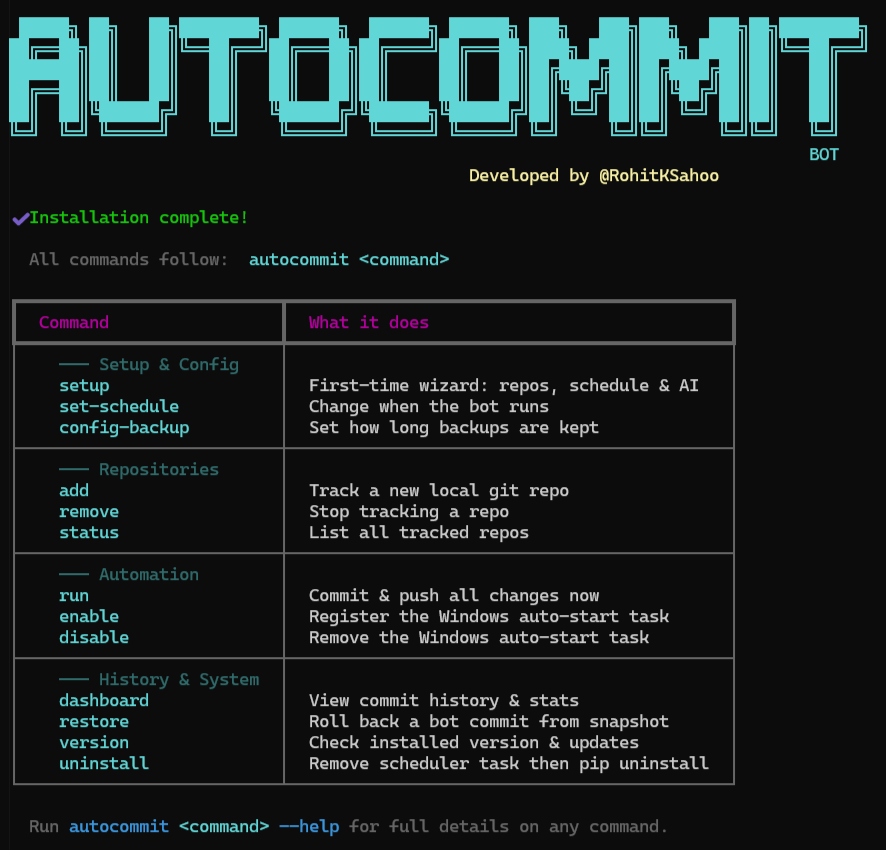

# 🚀 AutoCommitBot (v1.1.5)

[](https://www.python.org/downloads/)
[](#license)
[](https://github.com/RohitKSahoo/auto-commit-bot)

**Maintain a professional GitHub presence with AI-powered automation and built-in security.**

AutoCommitBot is an intelligent, cross-platform CLI tool designed for developers who want to maintain a consistent contribution history without the manual overhead. It monitors your local repositories, generates meaningful commit messages using Google's Gemini AI, and manages the full Git lifecycle automatically.

---

## 🖥️ Preview

<p align="center">
  
</p>

---

## 🌟 Why AutoCommitBot?

* **AI Commit Messages** — Generates meaningful, context-aware commits instead of generic updates
* **Security (Secret Shield)** — Prevents accidental exposure of sensitive files and credentials
* **Natural Activity Mode** — Simulates realistic developer commit patterns
* **Backup & Restore** — Enables complete rollback of local and remote states
* **Automated Execution** — Runs seamlessly in the background on system logon

---

## ✨ Features

### Core Capabilities

* **AI Commit Generation** — Context-aware commit messages using Gemini with model fallback
* **Security Layer (Secret Shield)** — Automatic protection against sensitive file and credential exposure
* **Scheduling Engine** — Supports logon, fixed-time, and natural activity-based execution
* **Backup & Restore** — Pre-commit snapshots with full local and remote rollback capability
* **Repository Management** — GitHub repo discovery, selection, and automatic cloning
* **Dashboard & Analytics** — CLI-based insights into commit history and activity
* **Execution Reliability** — Built-in retry logic, conflict handling, and network checks


<details>
<summary>🔍 View Full Feature Breakdown</summary>

### ⚙️ Setup & Configuration

* GitHub Repository Discovery via API
* Interactive multi-select repo setup
* Base folder configuration
* Automatic cloning of missing repos
* Git authentication verification
* Backward navigation during setup

---

### 🕐 Scheduling System

* Logon trigger (Windows Task Scheduler)
* Fixed-time daily scheduling
* Randomized daily execution (9 AM – 11 PM)
* Natural Activity Mode (probabilistic commits with 48h enforcement)
* Runs with highest privileges
* Works on battery power

---

### 🔁 Commit Engine

* Smart change detection across repositories
* Commits real user changes with descriptive messages
* Generates fallback activity commits when idle
* Automatic pull → merge → push workflow
* Push retry logic on failure

---

### 🤖 AI Commit System

* Gemini AI integration for commit messages
* Model fallback chain: 2.5 Flash → 2.0 Flash → 1.5 Flash → Pro
* Diff truncation for large inputs (8000 chars)

---

### 💾 Backup & Restore

* ZIP snapshot before every commit
* Configurable backup retention (`config-backup`)
* Restore command with snapshot selection
* Automatic GitHub rollback via force push

---

### 📊 Dashboard & Management

* Dashboard with last 50 commits (rich table view)
* Commit classification (User vs Activity)
* Status command for tracked repos
* Add/remove repositories dynamically
* Persistent history tracking (500 entries)

---

### 🌐 Reliability Layer

* Internet availability check (retry up to 2 minutes)
* Automatic admin privilege escalation
* Resilient Git operations with fallback handling

</details>

---

## ⚙️ How It Works

1. Detects changes in tracked repositories
2. Syncs with remote using `git pull`
3. Analyzes `git diff` using Gemini AI
4. Generates a contextual commit message
5. Runs security checks (Secret Shield)
6. Commits and pushes changes
7. Stores a backup snapshot

All of this runs automatically in the background.

---

## 🚀 Getting Started

### Prerequisites

* Python 3.8+
* Git installed and configured
* (Recommended) Gemini API Key → https://aistudio.google.com/app/apikey

---

## 📦 Installation

### Option 1: From Source

```bash
git clone https://github.com/RohitKSahoo/auto-commit-bot.git
cd auto-commit-bot
pip install -e .
```

### Option 2: Via pip (Recommended)

```bash
pip install autocommitbot
```

---

## 🛠️ Usage

| Command                 | What it does                                                                        | When to use                                    |
| ----------------------- | ----------------------------------------------------------------------------------- | ---------------------------------------------- |
| `autocommit setup`      | Launches interactive wizard to connect GitHub, select repos, and configure schedule | First-time setup or reconfiguration            |
| `autocommit add [path]` | Adds a local Git repository to tracking (defaults to current folder)                | When starting a new project you want automated |
| `autocommit run`        | Manually scans repos, commits changes, and pushes to GitHub                         | Testing or forcing an immediate commit         |
| `autocommit dashboard`  | Displays last 50 commits with stats (user vs activity)                              | Monitoring activity and verifying behavior     |
| `autocommit status`     | Lists all tracked repositories and their state                                      | Checking what the bot is managing              |
| `autocommit enable`     | Activates automation via scheduler (logon/time-based)                               | Turning on background automation               |
| `autocommit disable`    | Stops automation and removes scheduled task                                         | Temporarily or permanently stopping the bot    |
| `autocommit restore`    | Restores a previous backup and force-pushes to GitHub                               | Rolling back unwanted changes or commits       |

---

### ⚠️ Notes

* Automation runs only on tracked repositories
* `restore` performs a **force push** (overwrites remote history)
* `run` is for manual triggering, not regular use
* Internet connection required for full functionality

---


## 🔐 Security Notes

* Your code is **not stored externally** (only analyzed for commit messages)
* Sensitive files are automatically excluded via `.gitignore`
* `restore` uses **force push** — use with caution

---

## 🆘 Support & Contributions

* Report issues: https://github.com/RohitKSahoo/auto-commit-bot/issues
* Contributions welcome (see `CONTRIBUTING.md`)
* Additional docs in `/docs`

---

## 👤 Maintainer

Maintained by **[@RohitKSahoo](https://github.com/RohitKSahoo)**

---

## 📄 License

Licensed under the MIT License. See `LICENSE` for details.

---

## 🧾 TL;DR

AutoCommitBot is not just automation—
it’s a **smart Git workflow layer with AI, security, and recovery built in**.
